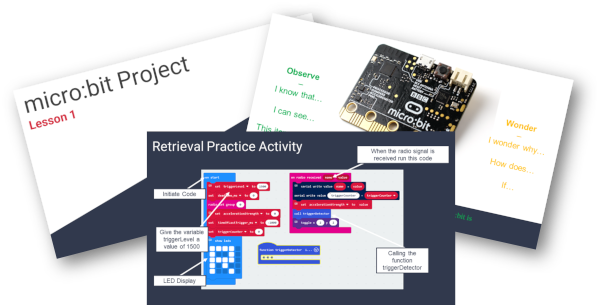
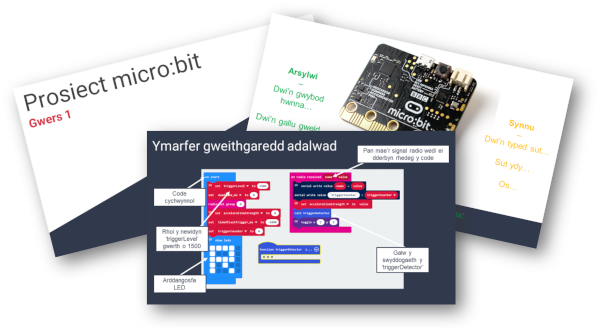
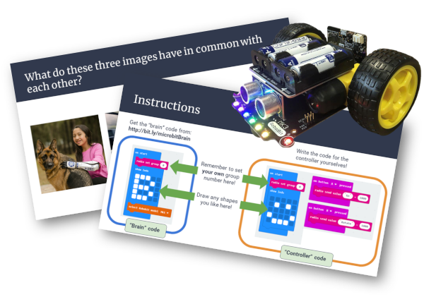

You can download the full 'delivery packs' for the two activities we created here, and we'd love to hear from you if you try any of these ideas out during your classes!

### Pack 1



 

The activity in this pack involves exploring use of the micro:bit accelerometer to use as a 'step-counter'. Data are streamed from a remote micro:bit (in the pupil's pocket) to the connected micro:bit - allowing real-time view of the data as the steps are taken.

[Download Pack 1 here in English](../teacherpacks/ENGINmakers_TeacherPack1_English.zip)

[Download Pack 1 here in Welsh](../teacherpacks/ENGINmakers_TeacherPack1_Welsh.zip)

And here are the direct links to the MakeCode that is used in this pack:
- Code for the transmitter: [http://bit.ly/microtransmit](http://bit.ly/microtransmit)
- Code for the receiver: [http://bit.ly/microreceive](http://bit.ly/microreceive)
- Updated code for the receiver to include step counter: [http://bit.ly/microcounter](http://bit.ly/microcounter)

 

### Pack 2



 

The activity in this pack involves using the 'pitch' and 'roll' variables derived from the micro:bit accelerometer to create an analog remote controller for a robot buggy. This does also requires having access to a robot buggy (it can be of almost any kind that is micro:bit compatible - code would need adaption to robots other than the Robo:bit Mk1, but please just contact [gallichand@cardiff.ac.uk](mailto:gallichand@cardiff.ac.uk) ).

[Download Pack 2 here in English](../teacherpacks/ENGINmakers_TeacherPack2_English.zip)

[Download Pack 2 here in Welsh](../teacherpacks/ENGINmakers_TeacherPack2_Welsh.zip)

And here are the direct links to the MakeCode that is used in this pack:
- The 'brain' code that goes on the robot: [https://bit.ly/microbitBrain](https://bit.ly/microbitBrain)
- Example of controlling the robot with simple 'digital' commands: [https://bit.ly/digitalExample](https://bit.ly/digitalExample)
- Example of analog controller that just moves forwards and backwards: [https://bit.ly/analogExample](https://bit.ly/analogExample)
- Example of the complete controller, including 'Grabber' control: [https://bit.ly/analogExampleComplete](https://bit.ly/analogExampleComplete)

